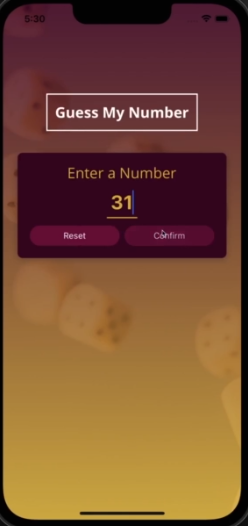
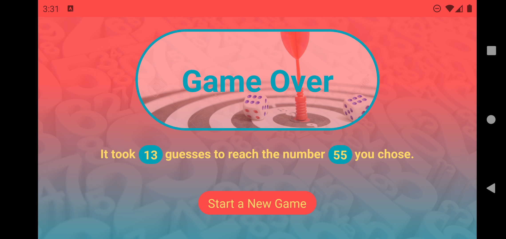
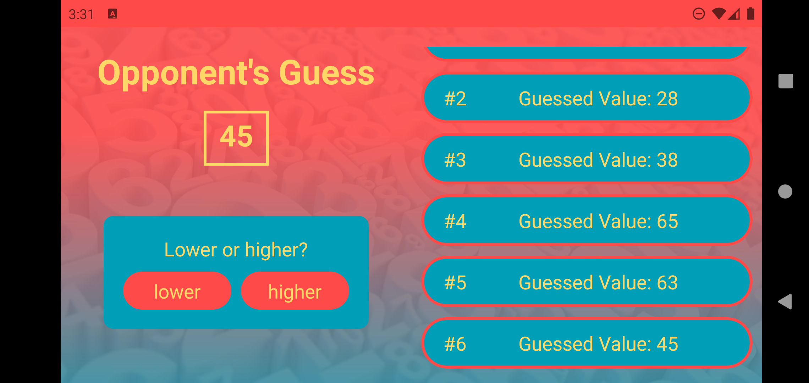

# Game App

# What the app does

- the user should be able to choose a number between 0 and 100
- the app tries to guess what the user entered through random guesses
- the user should tell the computer whether the guessed number is below or over the chosen number
- the game should continue till the number is guessed correctly
- all the guesses of the computer should be shown to the user
- a screen should be shown at the end showing the total number of guesses

# How the app looks

## Number Input Screen

The first screen where the user inputs the number should show:

- a text input for the user to enter the number
- a button for submitting the number
- a button for resetting the text input
- some guiding texts

it should be checked that the content of the text field complies with these criteria:

- the input should be a number between 0 and 100 (exclusive)

## Guessing Screen

The screen should show:

- the current guessed number (this number changes till reach the correct number)
- 2 buttons for the user to given indication to the app whether the chosen number is greater or smaller than the guessed number
- a list of the guesses made by the app

The app should prevent the user from giving wrong indications

## Game Over Screen

The screen should show:

- fixed image (implying success)
- the number of guesses taken by the computer & the chosen number by the user
- a button to restart the game

# Main New Concepts

- dealing with shadows differently on both android and iOS where on the android `elevation` property is used while in iOS a couple of styling properties are used to achieve the same result
- using expo `LinearGradient`
- avoiding notches using `SafeArea`
- using expo icons & fonts

# My Version

# Next Module (Responsiveness and Adaptiveness)

## Main New Concepts

- using `Dimensions` api to get the width & height of a screen
- using `useWindowDimensions` hook to make observe any change in screen dimension in the code
- using `KeyboardAvoidingView` to solve the problem of the keyboard covering of the screen content (specially on iOS)
- writing platform specific code using `Platform` api & naming files according to the platform it targets e.g. `Component.android.js` and `Component.ios.js`

## What Changed in Screens

less top margin over the heading

allow content to view using `ScrollingView` while keyboard is shown

adjusting the positions of buttons 

adjusting image size in landscape

## My Modifications

# Video Explanation

[https://www.youtube.com/watch?v=jdU2yAX3R8Y](https://www.youtube.com/watch?v=jdU2yAX3R8Y)